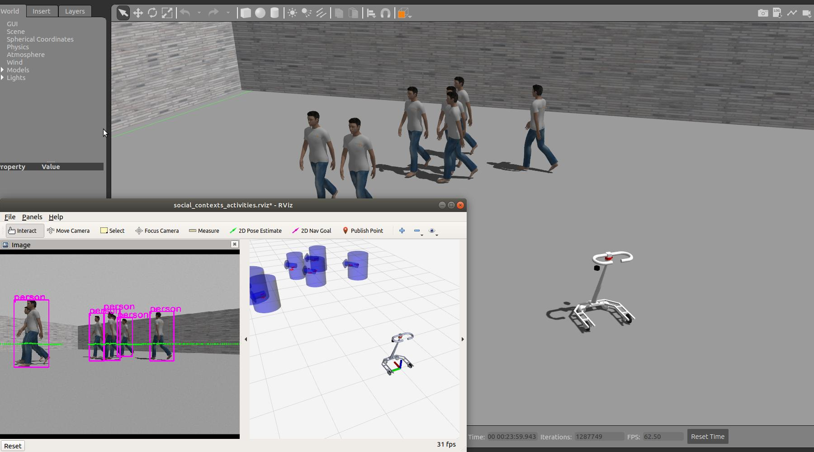
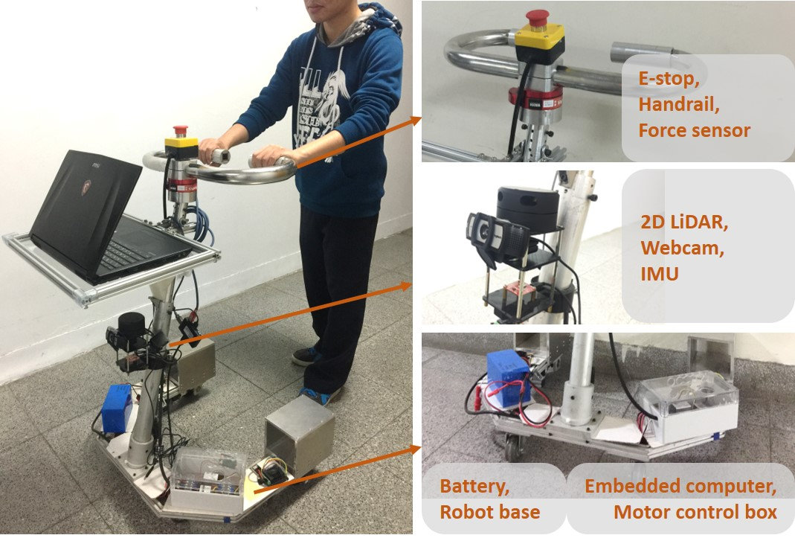

# socially-aware-walker
The repo is prepared for the active walker project for elders or people in mobility impaired.

If you are interested in this project, please check out our [wiki page](https://github.com/coolcat647/socially-aware-walker/wiki).

Simulation | Real walking assist robot
--- | ---
 | 
The walking assist robot is detecting and tracking the pedestrians in Gazebo. | The walking assist robot is composed of human force sensor, perception module, embedded computer, and motor controller.

<!-- scan_image_ _ _test         odom_filtered -> odom   (4)
scan2localmap_node_test     odom_filtered -> odom   (4)
path_finding_node_test      odom_filtered -> odom   (line 96) -->
